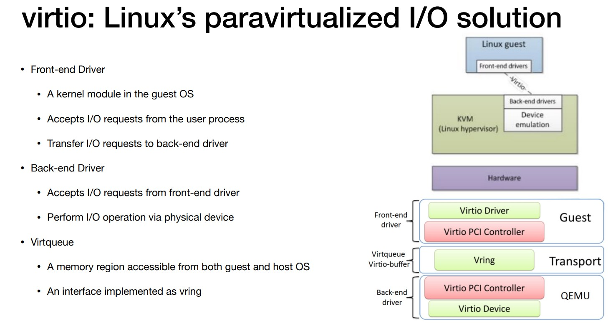
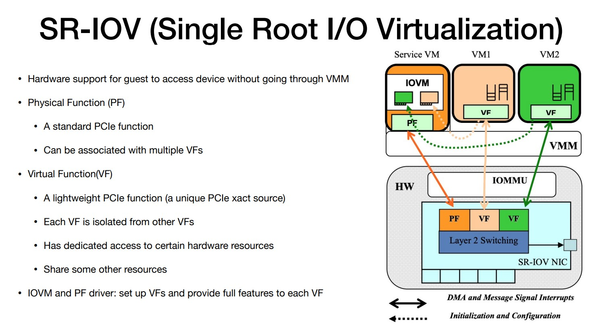

# Virtualizing I/O

## Device virtualization techniques

### Direct access：VM 对于设备有所有权，排外访问

优点：

- 快速，因为 VM 可以像 native machine 一样使用设备

- 简化机器：限制需要的设备驱动

缺点：

- 硬件接口对于 guest 可见（对于迁移不友好）

- 很难进行 interposition（很难进行 trap & emulate）

- 需要相当多的设备（假设有 100 个 VMs）

### Device emulation：VMM 在软件中模拟设备

- 使用纯软件实现一个裸机上的设备

- 甚至可以模拟不存在的设备

优点：

- 平台稳定（便于迁移）

- 允许插入

- 不需要特殊硬件支持

缺点：

- 可能比较慢（因为是软件模拟）

### Para-virtualization：把驱动分成 guest 部分和 host 部分

- VMM 提供新型设备

- guest OS运行一个新的驱动（froent-end driver）

- VMM 运行一个 back-end driver 对于每个 froent-end

- VMM 最终运行真实的设备驱动来驱动设备

### Hardware assisted: 硬件设备提供隔离的 "virtual interfaces"

- 支持虚拟化的设备可以配置为在 PCI 配置空间中显示多个虚拟功能

- VMM 分配一个或多个虚拟功能给 VM 通过映射虚拟功能实际的配置空间

## Storage virtualization

### Virtual Disk

- Virtual disk 实际上就是在 host file system 中的一个文件

- Hypervisor 映射 disk blocks 到 file offsets
  
  - Flat file(fix sized virtual disk)
  
  - Indexed file(virtual disk can grow demand)

## Network virtualization

