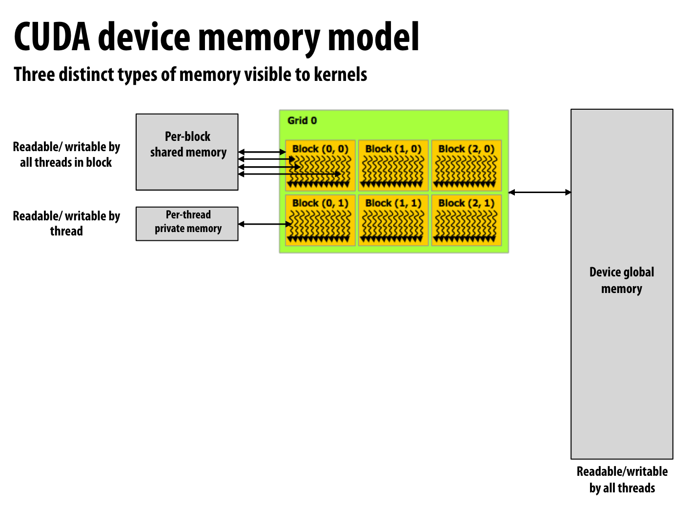
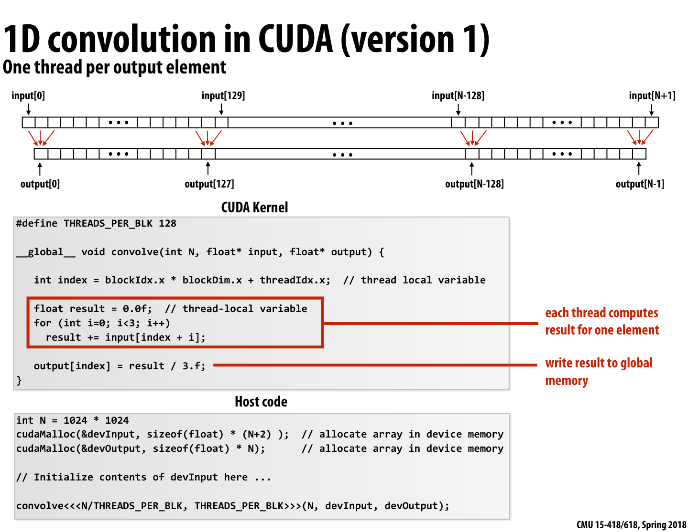
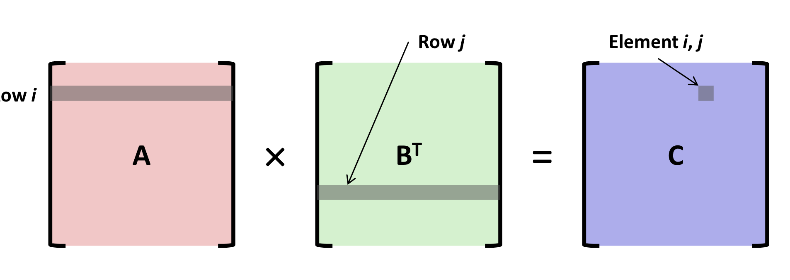
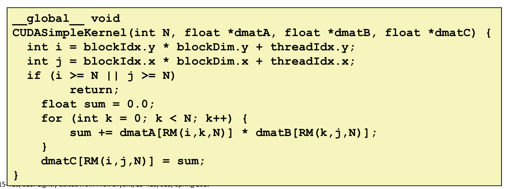
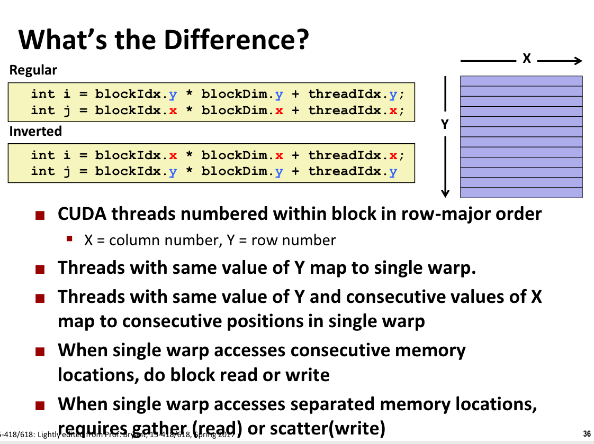

# CUDA

- "Host"：在 CPU 上串行执行

- "Device"：在 GPU 上并行执行

单个块的线程上限是 1024。

CUDA 是 SPMD（单程序流多数据流）。CUDA 将其分解成 block 并将 block 调度到不同的 SMs 上。

Host 和 Device 有不同的地址空间，需要明确通过 `cudaMalloc` 进行内存分配，`cudaMemcpy` 实现内存间的拷贝。

- 每个块有共享内存可以被块中所有内存读写。

- 每个线程也有私有内存。

## 一个卷积的例子

有一些问题：

- 读取太多次全局内存（每个线程进行三次读取，并且不会共享）。

- 添加了共享内存

## CUDA syncronization constructs

- `__syncthreads`
  
  - 内存栅栏：等待在块中所有线程到达该点。

- Atomic operations
  
  - 原子指令作用在全局内存和共享内存变量上。

- Host/device synchronization
  
  - Implict barrier across all threads ay return of kernel.

## Vocabulary

- Kernel：The work，函数的写法，可以在 GPU 核上并行执行。

- Thread：与 kernel 工作相关的实例的抽象。

- Thread Block：线程和相关工作的划分，将被分配到 SM 上运行。

- Grid：所有 blocks 的集合。

- Streaming Multiprocessor（SM）：A collection of CUDA Cores architected together to form a single GPU. Threads within a thread block concurrently execute on an SM.

- Warp：SM 内创建的 block 的划分，用于将工作派发给 cores。在 warps 中的每个线程都有可用的 core 前不会被调度。

## Syntax

- someGlobalFuctionName<<N,M>>
  
  - Kernel Launch
  
  - N thread blocks
  
  - M threads per thread block

- blockIdx: block index within the(up to 3D) grid
  
  - threadIdx.x is 1D index

- threadIdx: thread index within the(up to 3D) thread block 
  
  - threadIdx.x is 1D index

- int index = threadIdx.x + blockIdx.x * M;
  
  - Global thread index, given M threads per block

- blockDim, gridDim
  
  - 3D block and grid dimensions
  
  - E.g., blockDim.x, gridDim.x, etc.

## Why is printf() werid?

- printf() output is stored in a circular buffer of a fixed size.
  
  - If the buffer fills, old output will be overwritten. The buffer's size defaults to 1MB and can be configured woth `CUDADeviceSetLimit(CUDALimitPrintfFifoSize, size_t size)`.

- This buffer is flushed only for 
  
  - the start of a kernel launch
  
  - synchronization(e.g. CUDADeviceSynchronize())
  
  - blocking memory copies(e.g. CUDAMemCpy(...))
  
  - module load/unload
  
  - context destruction

## Application Example: NxN Matrix Multiplication

### 简单实现

### Optimization #1: Pretranspose

使用 B 的转置进行计算具有更好的程序

### Simple CUDA Implementation

### MM Optimization #2: Partitioning into Blocks

## Block/Thread Notation

- Idea(One-dimensional version)
  
  - Executing threads grouped into blocks
    
    - Each contains same number of threads
      
      - Host program specifies block size(blockDim.x)
  
  - Host program makes sure there are enough blcoks to generate N threads
  
  - Some threads in last nlock should not get used

## CUDA Program

- CUDA file(.cu) contains mix of device code & host code

- Device Code
  
  - Kernels(\__glocal\__)
    
    - Code for threads
    
    - Must only reference device memory
  
  - Device functions(\_device\_)
    
    - Called by kernels
    
    - Only reference device memory
    
    - Do not generate new threads

## CUDA Inverted Indexing

