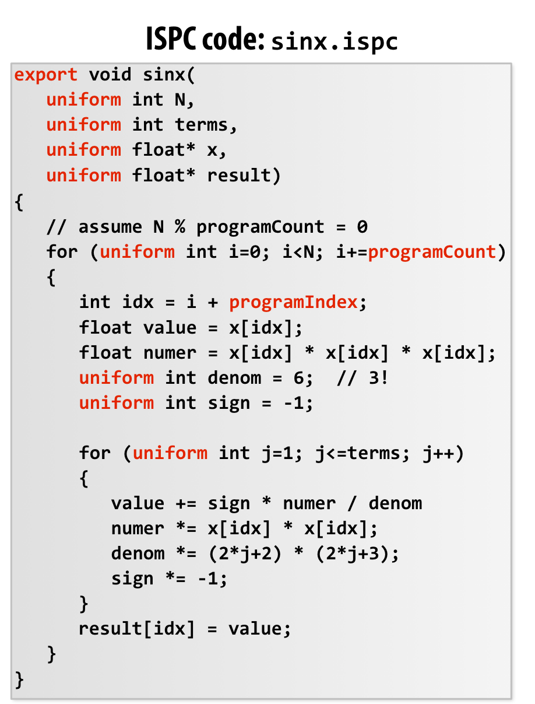
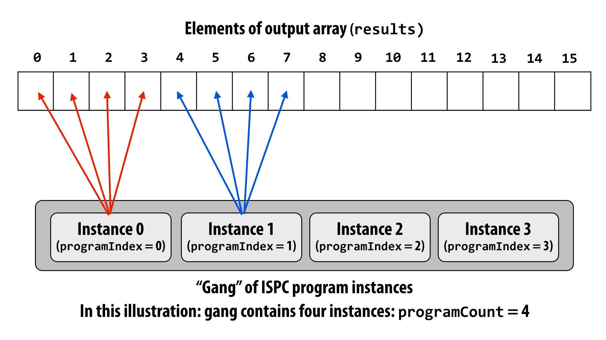

# 并行编程

## Programming with ISPC

- Intel SPMD Program Compiler(ISPC)

- SPMD: single program multiple data

**ISPC Keywords:**

- programCount: number of simultaneously executing instances in the gang(unuform value)

- programIndex: id of the current instance in the gang.(a non-uniform value:"varying")

- uniform: A type modifier. All instances have the same value for this variable. Its use is purely an optimization. Not needed for correctness.

**sin(x) in ISPC: version2:**

**foreach: key ISPC language construct**

- foreach declares parallel loop iterations
  
  - programmer says: these are the iterations the instances in a gang must cooperatively perform

- ISPC implementation assigns iterations to program instances in gang
  
  - Current ISPC implementation will perform a static interleaved assignment(but the abstraction permits a different assignment)

- `reduce_add`

## Three models of communication

### Shared address space model

- Threads communicate by reading/writing to shared variables

- Shared variables are like a big bulletin board

- HW implementation of a shared address space
  
  - SMP: Uniform memorry access time（可能对每个核来说都比较糟糕）
  
  - Commodity X86 examples：On-Chip Network, Crossbar Switch
  
  - Non-uniform memory access(NUMA)：在共享内存时，一些内存的副本可能与其他副本不同

### Message passing model of communication

- 线程只有私有数据

- 线程通过 send/receive 消息通信

- Implementation: MPI(message passing interface)

### Data-parallel model

可能会产生不确定行为

流编程模型：

- Stream: collections of elements. 元素可以被独立处理

- Kernels: Side-effect-free functions. 

- Gather/scatter: two key data-parallel communication primitives. 
  
  - `gather(R1, R0, mem_base)`
