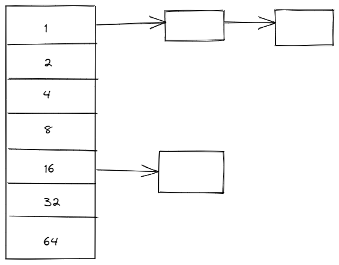

# 内存管理

## 物理内存分配和管理

### 伙伴系统(buddy system)

伙伴系统在现代操作系统中被广泛地用于分配连续的物理内存页。其基本思想是将物理内存划分成多个连续的块，以块为基本单位进行分配。不同块的大小可以不同，但每个块都由一个或多个连续的物 理页组成，物理块的数量必须是 2 的 n 次幂（0 <= n < 预设的最大值），其中预设的最大值将决定能够分配的连续物理内存区域的最大大小，一般由开发者根据实际选定。

当一个请求需要分配 m 个物理页的时候，伙伴系统将寻找一个大小合适的块，该块包含 2^n 个物理页，且满足 2^n-1 < m <= 2^n。在处理分配请求的过程中，大的块可以分裂成两半，即两个小一号的块，这两个块互为伙伴。分裂得到的块可以继续分裂，直到得到一个大小合适的块去服务相应的分配请求。在一个块被释放后，分配器会找到其伙伴块，若伙伴块也处于空闲的状态，则将这两个伙伴块进行合并，形成一个大一号的空闲块，然后继续尝试向上合并。由于分裂操作和合并操作都是级联的，因此能够很好地缓解外部碎片的问题。

分配块首先从链表中查找，例如想要去获取大小为 15 KB 的块，首先从 16 KB 的链表中找，若从 16 KB 的链表中没有发现，就向更上级的链表寻找，找到后将其进行分裂直到 16 KB。释放时将块地址插入到对应的链表中，若存在伙伴块，则将其进行合并（互为伙伴的物理地址只有一位不同，该位由块大小决定）。

### SLAB 分配器

伙伴系统最小的分配单位是一个物理页（4KB），但是大多数情况下，内核需要分配的内存大小通常是几十个或几百个字节，远远小于一个物理页的大小。如果仅仅使用伙伴系统进行内存分配，会出现严重的内部碎片问题，从而导致资源利用率降低。

SLUB 分配器是为了满足操作系统分配小对象的需求，其依赖于伙伴系统进行物理页的分配。简单来说，SLUB 分配器做的事情是把伙伴系统分配的大块内存进一步细分成小块内存进行管理。为了避免外部碎片，SLUB 分配器只分配规定大小的内存块，通常为 2^n 个字节（一般来说，3 <= n < 12）。

SLUB 分配器向伙伴系统申请某一种大小的内存块所维护的内存资源池。SLUB 分配器向伙伴系统申请一定大小的物理内存块（一个或多个连续的物理页），并将获得物理内存块作为一个 slab（slab 在这里代指这个物理内存块对应的数据结构）。slab 会被划分成等长的小块内存，并且其内部空闲的小块内存会被组织成空闲链表的形式。一个内存资源池通常还有 `current` 和 `partial` 两个重要指针。`current` 指针仅指向一个 slab，所有的内存分配请求都将从该指针指向的 slab 中获得空闲内存块。`partial` 指针指向由所有拥有空闲块的 slab 组成的链表，当 SLUB 分配器接收到一个分配请求时，它首先定位到能满足请求大小且大小最接近的内存资源池，然后从 `current` 指针指向的 `slab` 在取出一个空闲块后，不再拥有空间块，即全部分配完，则从 `partial` 指针指向链表中取出一个 slab 交给 `current` 指针。如果 `partial` 指针指向的链表为空，那么 SLUB 分配器就会向伙伴系统申请分配新的物理内存作为新的 slab。这样的分配设计，一方面有效避免了外部碎片，另一方面通常分配速度很快(直接从 `current` 指针指向的 slab 取出第一个空闲块即可)。通过合理地设置不同大小的内存资源池，也能够尽可能地减少内存碎片导致的开销。

当 SLUB 分配器接收到一个释放请求时，它将被释放的块放入相应的 slab 的空闲链表中。如果该 slab 原本已经没有空闲块，及全部分配完，则将其重新移动到 partial 指针指向的链表中；如果该 slab 变为所有内存块都是空闲的，即原来仅分配出去一块，那么可以将其释放，还给伙伴系统。

## 引用

- 现代操作系统 原理与实现（陈海波 夏虞斌著）
