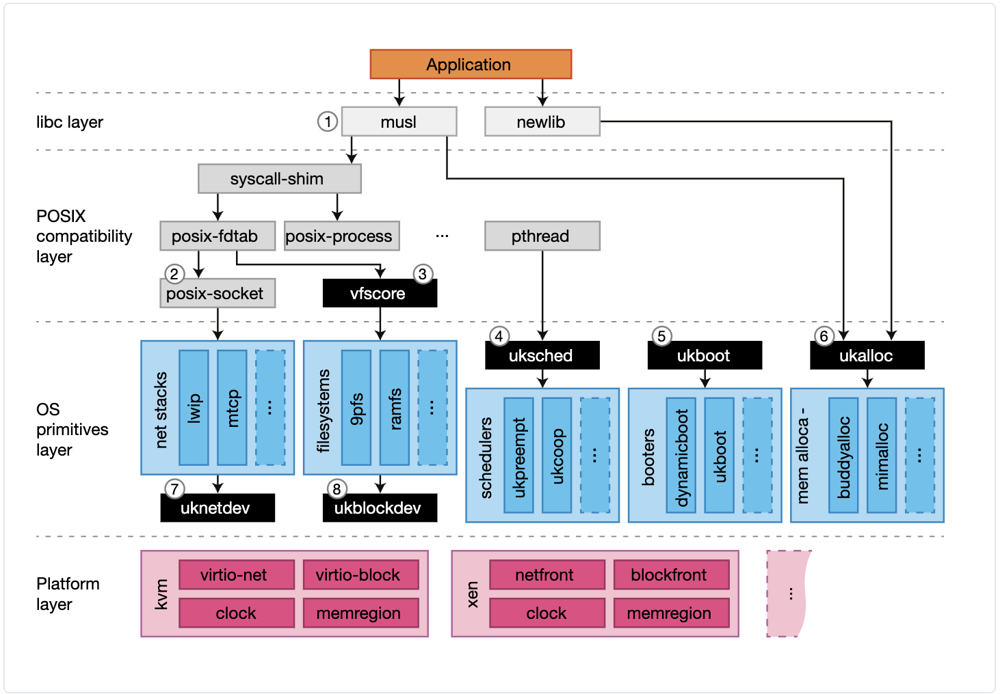

# 模块化内核

## Unikernel

Unikernel 是专用的，单地址空间的，使用 library OS 构建出来的镜像。没有用户空间和内核空间之分，只有一个连续地址空间，这样允许 unikernel 可以更快地执行，但是缺乏内存保护。unikernel 是为了云环境特殊设计，在这个环境下主机必须可信任。

### 一些宏内核的问题

- 虚拟化环境中内核和应用程序的切换可能是多余的，因为由 hypervisor 来进行隔离，会导致性能下降。

- 在单应用 domain 中多地址空间没有用。

- 对于 RPC 类型的服务器，线程是没有必要的，单进程, run-to-completion event loop 可以得到一个好的性能。

- 对于基于 UDP 的性能应用中，许多 OS 网络栈是不需要的：app 可以仅仅使用驱动 API，就像 DPDK 做的一样。

- 直接访问 NVMe 存储可以不需要文件描述符，VFS 层和文件系统。

- 内存分配器对于应用程序性能有巨大的影响，通用分配器对于很多应用程序不是最佳的选择。如果应用程序可以选择不同的内存分配器将十分完美。

## Unikraft

- Library Components

- Configuration

- Build Tools

### Unikraft Libraries

- Core libraries: memory allocators, schedulers, filesystems, network stacks and drivers

- External libraries: libc, openssl

### 设计理念

对于每个单应用创造特定的内核以确保最佳性能：

- 单地址空间：针对单一应用场景，可以通过网络通信使不同的应用程序相互交流。

- 全模块化系统：所有组件，包括操作系统原语，驱动，平台和库应当容易添加和删除。

- 单保护级别：没有 user/kernel 空间隔离，因此避免了处理器上下文切换的开销，但是不排除隔离（例如，微型库的隔离）。

- 静态链接：开启编译器特性。

- POSIX 支持

- 平台抽象：可以生成一系列不同的 hypervisors/VMMs 的镜像

### 结构

使用模块化来构建专用内核，将操作系统功能分为细粒度组件，并仅通过明确定义的 API 进行通信。通过仔细的 API 设计和静态链接，而不是为了性能而缩短 API 边界可以提高性能。以下是两个主要部分：

- Micro-libraries 是实现了核心 Unikraft APIs 的软件组件；我们将它们拆分成库并且它们有最小的依赖且可以任意小。所有 micro-librarys 实现了相同的 API。除此之外，Unikraft 还支持能够从外部项目（OpenSSL,musl,Protobuf 等等），应用(Redis, SQLite 等等)提供的功能，甚至是平台（Solo5,Firecracker,树莓派3）。

- Build-system：用户提供编译哪个组件。

Unikraft 可以通过以下两种方式来提升性能：

- 使用修改过的应用，通过消除 syscall 开销，减少 image 大小和内存消耗，并且通过选择有效率的内存分配器。

- 专用化，通过将应用程序适配到更低级 API，以利用性能优势，尤其是对于寻求高性能磁盘 IO 吞吐量的数据库应用程序而言。



## Arceos

### 目标：

- 兼容 rust api 和 rust 应用程序

- 在 unikernel 支持 tokio，提高 IO 性能


**当执行了 `make A=apps/net/httpserver ARCH=aarch64 LOG=info NET=y SMP=1 run` 发生了什么？**

根据 cargo 不同的 feature 来进行条件编译。

- `_cargo_build`: 首先根据不同的语言，选择不同的编译方法，例如对于 rust，调用 `call cargo_build,--manifest-path $(APP)/Cargo.toml`，其中 `$(APP)` 表示目前要运行的应用程序。

- 以 `httpserver` 为例，查看 unikernel 如何条件编译，首先在 `httpserver` 中的 `Cargo.toml` 的依赖项为：`libax = { path = "../../../ulib/libax", features = ["paging", "multitask", "net"] }`,这个表明需要编译 `libax` 并且有以上三个 features

- 查看 `libax`，找到以上三个 features，发现：
  
  - `paging = ["axruntime/paging"]`
  
  - `multitask = ["axruntime/multitask", "axtask/multitask", "axsync/multitask"]`
  
  - `net = ["axruntime/net", "dep:axnet"]`
  
  - 这里涉及到 `axruntime` ，`axtask`，`axsync` 等 module，并对这些 module 进行条件编译

- `cargo.mk`：这个文件里描述了如何使用 cargo 进行条件编译的方法，build 参数如下：

```
build_args := \
  -Zbuild-std=core,alloc -Zbuild-std-features=compiler-builtins-mem \
  --config "build.rustflags='-Clink-arg=-T$(LD_SCRIPT)'" \
  --target $(TARGET) \
  --target-dir $(CURDIR)/target \
  --features "$(features-y)" \
```

`cargo_build`:

```
define cargo_build
  cargo build $(build_args) $(1)
endef
```

这也就回到了最上层关于 `_caro_build` 命令的封装，将 `$(APP)/Cargo.toml` 作为顶层模块，引用其他模块，并进行条件编译构建 unikernel

**问题：ArceOS 中模块之间是否会互相引用状态？如何解决？**

**思考：如何将 hypocaust-2 拆分成模块化？**

kernel/hypervisor 模块复用
