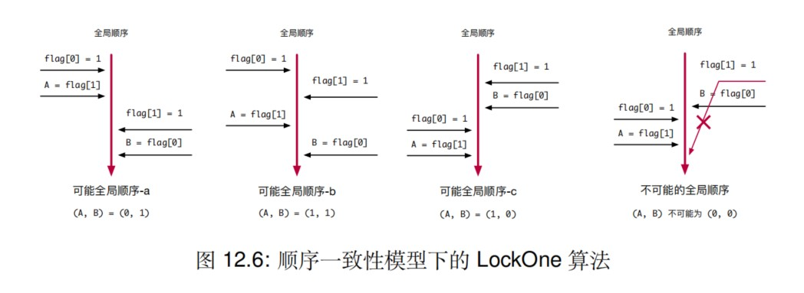
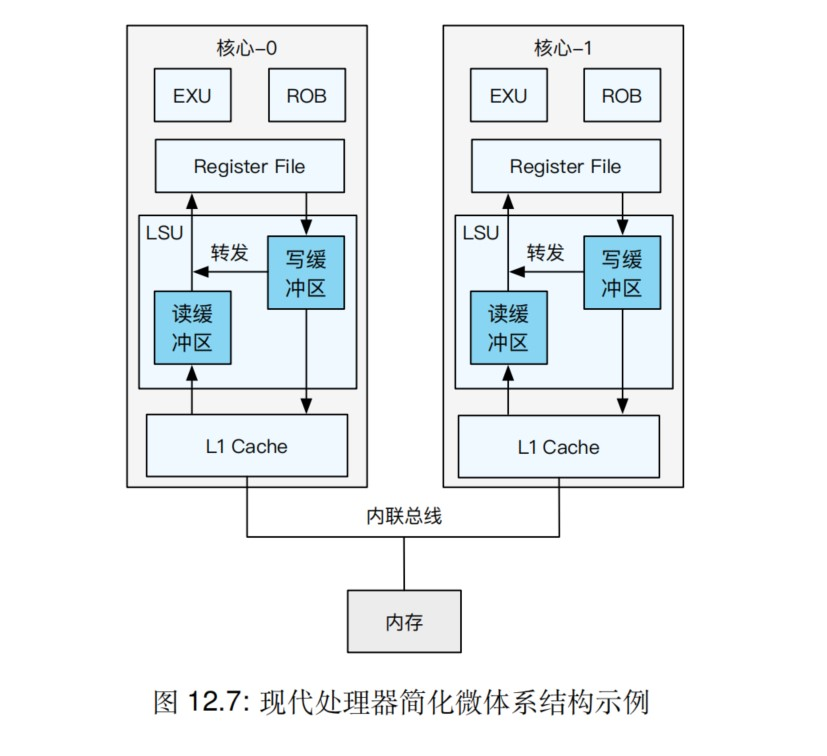

# 多核

## 内存一致性与硬件内存屏障

顺序处理器上，皮特森算法和 LockOne 算法可以保证互斥访问，但是乱序处理器不能保证上述算法互斥访问。即先检查对方的标志位再设置自己的标志位，可能两个线程同时进入临界区。

### 内存一致性模型

#### 严格一致性模型(Strict Consustency)

所有访存操作都按照编写顺序执行。

#### 顺序一致性模型(Sequential Consistency)

不要求操作按照其真实发生的时间顺序（即按照全局时钟定义的顺序）全局可见。不同核心看到的访存操作顺序一致，每个核心自己的读写操作可见顺序必须与其程序顺序保持一致。但是核的最新读操作不一定能读到其他核最新的修改。

#### TSO 一致性模型(Total Store Ordering)

TSO 一致性模型进一步弱化了访存一致性保证。在 TSO 一致性模型中，其保证**对不同地址且无依赖**的读读、读写、写写操作之间的全局可见顺序，只有写读的全局可见顺序不能得到保证。TSO 通过加入一个写缓冲区达成优化性能的目的，该写缓冲区能够保证写操作按照顺序全局可见。

#### 弱序一致性模型(Weak-ordering Consistency)

在一个和核心上，弱序一致性模型不保证任何**不同地址且无依赖**的访存操作之间的顺序。

### 内存屏障

内存模型对于上层软件不透明。在较弱的内存一致性模型中，为了保证访存操作全局可见，开发者必须手动添加硬件内存屏障(Barrier/Fence，简称内存屏障)。

### 硬件视角下的内存模型与内存屏障

## 非一致内存访问

随着单处理器中核心数量增多以及多处理器系统的出现，单一的内存控制器逐渐成为了性能瓶颈。因此多核及多处理器系统将多个内存控制器分布在不同的核心或处理器上。这种设计在多处理器系统中非常常见，每个处理器往往被分配一个单独的内存控制器。因此，不同的核心有可以快速访问的本地内存，其也可以访问其他处理器上的远程内存，其访问时延远高于访问本地内存的时延。由于访问不同类型内存的时延不同，这种架构被称为**非一致内存访问(Non-Uniform Memory Access，NUMA)**。

