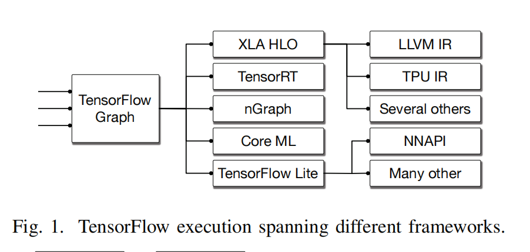
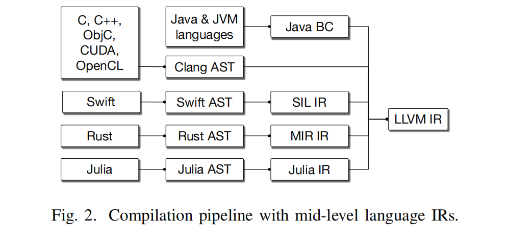

# MLIR: Scaling Compiler Infrastructure for Domain Specifific Computation

## Introduction

- LLVM IR: roughly  “C with vectors”

- JVM: object-oriented type system with a garbage collector

有一些语言在更高级或更低级的 IR 中进行抽象更好分析。例如 LLVM IR 很难对 C++ 进行源码分析。Swift，Rust 等语言会开发新型 IR 去解决领域特定问题。在 ML 领域使用 ML graph 作为领域特定抽象。

MLIR 是为了解决 解决这些领域特定问题面临的问题和挑战而抽象出的层级：

- 基于 SSA

- 提供方言 IR 定义

- 提供大量基础设施，例如文档，调试

### 为什么需要构建 MLIR？

- 如今的深度学习框架生态不一致，许多不同的深度学习框架有不同的编译器，图技术以及运行时，如图一。

- 整个编译器领域有同样问题，不同语言会构建自己的高级 IR，如图二。

## Design Principles

