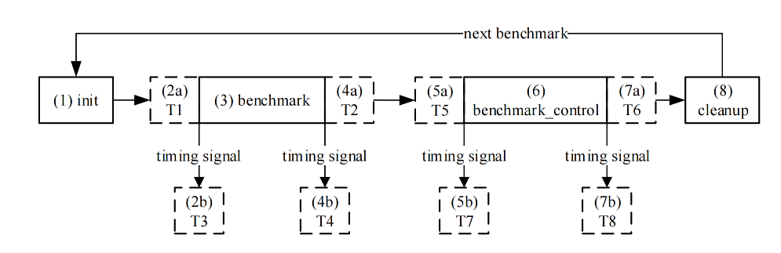
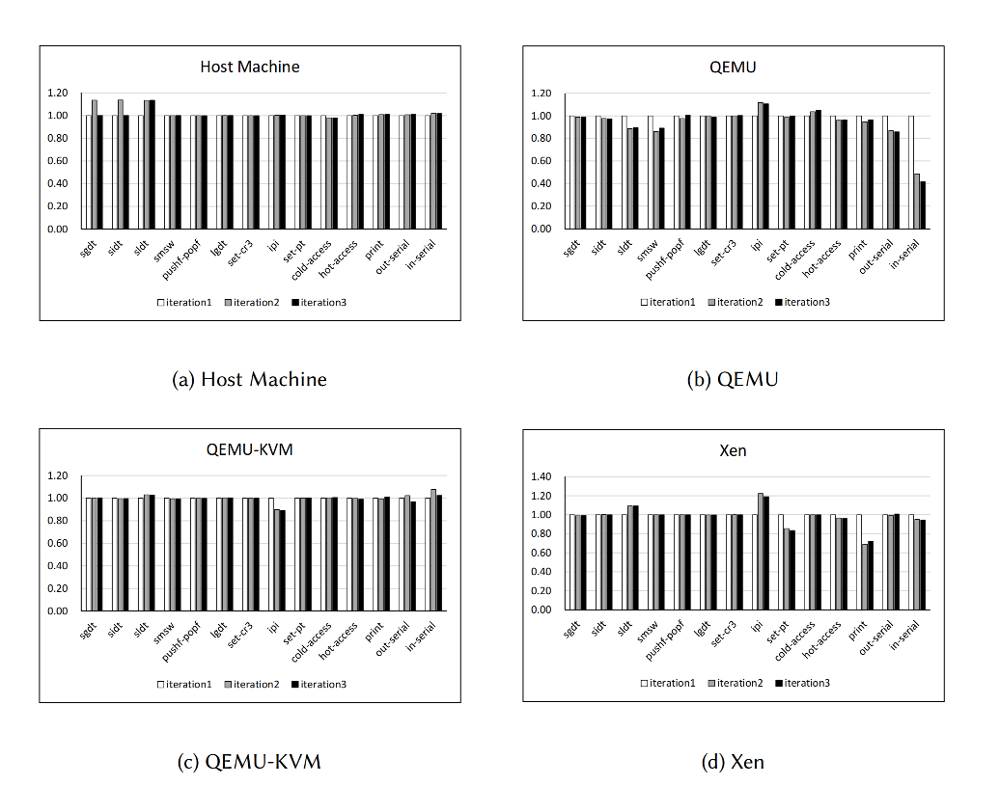
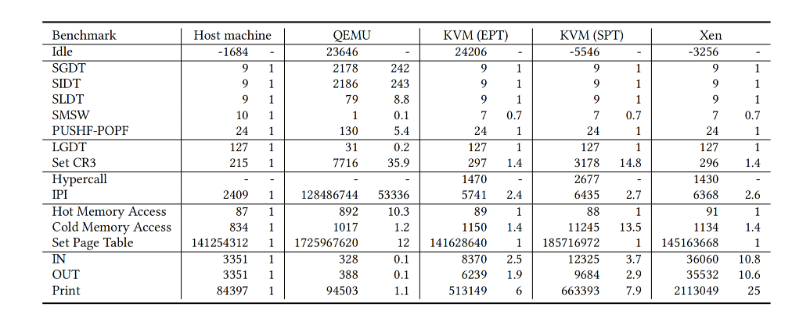

# HyperBench: A Benchmark Suite for Virtualization Capabilities

## COST MODEL

- $GNR(Guest Native Ratio) = \frac{T_{guest}}{T_{native}}$

- $T_{guest} = T_{direct} + T_{virt}$

- $T_{virt} = T_{cpu} + T_{memory} + T_{io} + \eta$

- $T_{cpu} = C_{sen} * T_{sen} + C_{ext} * T_{ext}$

- $T_{memory} = C_{switch} * T_{switch} + C_{sync} * T_{sync} + C_{cons} * T_{cons} + C_{two} * T_{two}$

- $T_{io} = C_{in} * T_{in} + C_{out} * T_{out}$

## HYPERBENCH BENCHMARKS

### 敏感指令

- 非特权指令：在硬件辅助虚拟化中，VM 执行这些指令和 OS 相同，对于二进制翻译来说会触发翻译流程。

- 特权指令：除了硬件辅助虚拟化技术允许特权级指令直接运行在物理 CPU 上；对于 trap & emulate 策略，特权指令会触发 trap；对于动态二进制翻译，特权指令将会被翻译成一系列 Shadow Structures 相关的正常指令。

### 异常

异常 benchmarks 需要触发特定的虚拟化异常指令，包括：Hypercall、虚拟核间中断（IPI）。

### 内存

内存 benchmarks 主要需要触发从 GVA 到 HPA 的翻译进程和相关的操作，例如 hypervisor-level 的页表的创建，同步 guest 页表和 hypervisor-level 页表。做不同模式的内存访问最直接的方式是触发这些事件。

- Hot Memory Access: 由于程序的时间局部性和空间局部性使得 hot memory access 在真实世界中具有普遍性。虚拟 TLB 应该确保 hot memory access 有一个尽可能高的命中率。TLB 命中率越高，硬件 TLB 和虚拟 TLB 之间的差别越小。在此基准测试中，工作集大小以及页面映射大小是可以调节的。如果工作集很大的话将会 overwhelm TLB 并且会触发更多的页表遍历。使用大页可以减少 TLB miss 次数。guest 和 host 必须同时使用 2MiB 的大页以保证处理器在虚拟化环境中使用 2MiB 的 TLB。可以通过调整 guest  页表大小和 hypervisor 页表大小来验证这个影响。
- Cold Memory Access: Cold Memory Access 意图去触发 TLB misses 并且触发 hypervisor page fault。QEMU 中的 cold memory access 只会造成二维页表遍历，因为 QEMU 中的内存在开始阶段就已经被分配了。由于一些 hypervisor-level 的页表在开始是空的（例如 SPT 和 EPT），因此 cold memory access 要求 hypervisor 重新创建页表。这个 benchmark 可以用来计算 $T_{memory}$ 的时间。
- Set Page Table: 这个 benchmark 会设置大量页表，既包含 hot memory access 也包含 cold memory access。这个 benchmark 模拟了大量内存分配的操作。


### I/O

IO benchmarks 主要用来测试 host 和 guest  的通信机制。hypervisor 可以通过模拟、半虚拟化、分配和 IO 设备共享等方式来支持 IO 请求。这些模型中的一个标准测试接口是应用程序和操作系统之间的接口。然后，应用程序的层级很高，应用程序的复杂测试用例可能会掩盖性能差距。任何模型都会通过 PIO 或者 MMIO 来访问真实物理设备。

- IN: 轮询和中断是 host 向 guest 通知的两个主要方式。benchmark 不断重复读取 serial port 寄存器用来模拟轮询 IO。对于 QEMU 来说，IO 指令被自己模拟。对于 QEMU/KVM 来说，在 QEMU 模拟 IO 指令之前，VM 会 trap 到 host kernel 然后交由 QEMU 来控制。对于 Xen 来说，IN benchmark 触发以下行为
  
  - VM trap 到 Xen
  
  - Xen 向 Dom0 发送 IPI
  
  - 将控制权交给 QEMU 并且模拟 IO 指令
  
  - 返回 VM

- OUT：作为 IN, OUT benchmark 的一部分，OUT benchmark 向串口寄存器不断输出字符。这个 benchmark 关注于从 guest 到 host 的通知机制的延迟。

- Print：这个 benchmark 关注于字符串，将一串字符从内存中输出到对应的 serial IO 中。

## IMPLEMENTATION


### Architecture

在 native 环境中，HyperBench 直接运行在硬件上。benchmark 的行为在 HyperBench kernel 中进行测量，成为内部测量。在虚拟化环境中，HyperBench kernel 运行作为 test VM。在独立的裸机 hypervisor 中（例如 Xen），计时程序运行在特权级 VM 中；在 host hypervisor 中，计时程序作为常规的应用程序运行在 host OS 中。benchmark 既可以实现为内部测量也可以实现为计时程序，后者被称为外部测量。对于外部测量来说，HyperBench 在 benchmark 前后向 UART 发送计时信号，UART 重定向到外部计时程序通过 pipe。对于 QEMU 来说，时钟信号输出到模拟的 serial port 并被重定向到 console(如果使用了 `-nographic` 选项)。一旦读取到时钟信号，计时应用程序将读取当前 counter 的值。对于虚拟化环境来说，常规用户经常使用内部测量，因为它们没有使用时钟应用程序的权限。




- 可移植性：尽管不同的 bechmarks 关注于不同的特性，所有的 benchmarks 共享底层的 **POSIH**。POSIH 和硬件直接交互。因此 HyperBench 能够运行在任何体系结构上只要对应在对应体系结构的硬件驱动已经被实现了。

- 可扩展性：HyperBench 的一个重要优势是添加一个新的 benchmarks 是相当容易的。那是由于 POSIH 在内存布局上进行了仔细地设计。当添加一个新的 benchmark 时许多函数可以被重用。**.benchmarks** 段是一个描述所有的 HyperBench benchmarks 所映射的所有数据结构的一个描述符表：

```c
typedef void ( ∗ function_t)();
typedef struct {
const char ∗ name ;
const char ∗ category ;
function_t init ;
function_t benchmark ;
function_t benchmark_control ;
function_t cleanup ;
uint64_t iteration_count ;
}benchmark_ t ;
```

### Measurement

有两种测量 benchmark 的方式，分别为内部测量和外部测量。但是无论哪一种都不完美。HyperBench 中的定时器可能不准确或者未完全校准；尽管 host 中的计时器更为准确，但从 HyperBench 到通知计时应用程序也有一定程度的变化。HyperBench 内核发送计时信号到计时应用程序完成读取硬件计数器之间的时间的稳定性决定了测量结果的准确性。 为了解决这个问题，HyperBench 设计了一个空闲基准测试，它执行两次连续的计数器读取。根据 Idle 的结果，相同或者更高次数的迭代可以抵消波动。

在测量多核系统性能的情况下，由中断和调度引起的变化会使测量结果偏移数千个周期。进一步提高外部测量、乱序执行和多核调度干扰的准确性被考虑在内。HyperBench 通过 grub 和将 VCPU 到 PCPU 进行映射来隔离 CPU。在获取时间前后使用指令屏障避免乱序执行或流水线扭曲测量结果。

## EVALUATION





上表展示了运行 benchmarks 的结果，单位是时钟/每次迭代。
