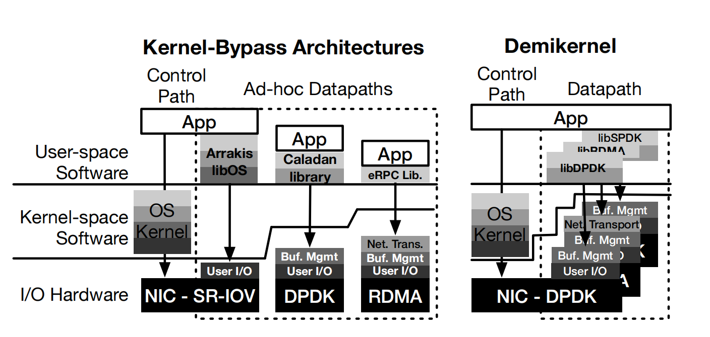

# The Deminkernel Datapath OS Architecture for Microsecond-scale Datacenter Systems

Zhang I, Raybuck A, Patel P, et al. The demikernel datapath os architecture for microsecond-scale datacenter systems[C]//Proceedings of the ACM SIGOPS 28th Symposium on Operating Systems Principles. 2021: 195-211.

## Abstract

数据中心和 IO 设备以微秒级运行，需要纳秒级操作系统，传统的基于内核操作系统会带来无法忍受的开销。本篇文章介绍了 Deminikernel，一种灵活的数据通路 OS，为了异构 kernel bypass 而设计，可以提供微秒级数据中心系统。

## Overview

数据中心 IO 设备和系统正在变成微秒量级：网络延迟，磁盘访问和内存系统，例如 Redis，能够实现单位微秒级别的延迟。Kernel-bypass 改变了传统操作系统内核架构，在 IO 通路中消除了内核的影响。如今有一些 kernel-bypass 库但是没有通用的解决方案。

因此，微秒级别的应用程序需要一个具有可移植的操作系统数据通路架构，该操作系统实现常见的操作系统管理：存储、网络栈、内存管理和 CPU 调度。除了支持异构设备的纳秒级延迟外，还需要支持微秒级应用。举例来说，零拷贝 IO 对于减少延迟来说至关重要，因此，微秒级系用需要需要具有清晰的零拷贝 IO 语义以及在应用和 OS 间协调共享内存的 API。同样，微秒级应用每几微秒执行一次 IO，因此应用程序和操作系统之间的细粒度 CPU 多路复用也很关键。

Deminikernel 运行与传统操作系统之上（例如 Linux 和 Windows）。每个库操作系统都是设备相关的；它会在可能的情况下进行 kernel-bypass 并且在用户空间库中实现剩余的操作系统管理。库操作系统的目的是在最小化 OS 负载的情况下简化微秒级 kernel-bypass 设备异构内核的开发。

## Demikernel Datapath OS Requirements

现代 kernel-bypass 设备，OS 和库能够在 IO 路径中消除内核的影响但不能代替全部功能，在 kernel-bypass 体系结构中留下了一片空白。这个空白暴露了一个关键的问题：什么是微秒级系统中正确的 datapath OS 的代替品？

### Support heterogenous OS Offloads

Portability 很有挑战性因为不同的设备 offload 需要不同的 OS 特性。例如，DPDK 提供了一种低水平的，裸的 NIC 接口，同时 RDMA 提供了带有拥塞控制和有序、可靠传输的网络协议。因此，使用 DPDK 工作的系统需要实现一个全网络栈，使用 RDMA 工作的系统不需要实现。

这种异构性来源于硬件设计长期以来的权衡。卸载（offload）更多特性可以提高性能但是增加了设备复杂性。距离来说，DPDK 现在是通用且被广泛使用的，但是 RDMA 在数据中心中实现了最低的 CPU 延迟开销。所以任何 datapath OS 必须同时支持二者。未来 NICs 可能会带来其他的权衡。

### Coordinate Zero-Copy Memory Access

Zero-copy IO 对于最小化延迟来说非常重要。然而，它需要很仔细地协调在 IO 设备、栈以及应用程序间进行访问。Kernel-bypass zero-copy IO 需要两种类型的内存访问协调方案，然而这两种方案对于程序员来说管理已经存在的 kernel-bypass OSe 很困难。

首先，kernel-bypass 需要 IO 设备的 IOMMU（或者用户态设备驱动）去执行地址翻译，需要 CPU的 IOMMU 和 TLB 协作。为了避免也错误并且确保在执行 IO 时地址映射保持固定, kernel-bypass 设备需要专门的 DMA-capable 内存，固定在内核里。不同设备工作方式不同：

- RDMA：显式 DMA 可用内存注册

- DPDK，SPDK：分离的 pool-based memory allocator

第二种形式涉及到对 IO 内存缓冲区的实际访问。因为 IO stack 和 kernel-bypass 设备直接工作在应用内存上，程序员禁止释放或者修改内存当正在进行 IO 时。这种协调不仅仅停留在等待 IO 完成的阶段。举例来说，TCP stack 可能会向网卡发送内存，但是网络丢失了 packets。如果 TCP stack 在此时修改或者释放了内存缓冲区，TCP stack 将没有机会重传。因此，应用程序在释放内存时必须与 TCP stack 进行协调。

### Multiplex and Schedule the CPU at µs-scale

微秒级数据中心系统每几毫秒就要执行一次 IO 操作：因此，一个 datapath OS 必须能够在相似的速度下进行多路复用以及调度 IO 处理程序。但是现存的内核抽象，累、类似进程和线程对于微秒级调度过于粗粒度。因此，kernel-bypass 内核缺乏一个通用的调度方案。

（介绍了一些现存方案）

这些系统都不是理想的，因为它们的调度决策仍然是分布式的，要么在内核和用户级调度器之间（对于DPDK系统），要么在代码中（对于RDMA系统）。最近的研究，比如eRPC，已经表明，在单个线程上复用应用程序工作和数据路径操作系统任务是必要的，以实现纳秒级的开销。因此，Demikernel的设计需要一个微秒级的调度抽象和调度器。

## Demikernel Overview and Approach

### Design Goals

- 简化微秒级系统开发

- 在异构系统中提供可移植性。Demikernel 应该让应用程序跑在多种不同 kernel-bypass 设备中（例如 RDMA 和 DPDK）和虚拟化环境中

-  实现纳秒级延迟开发

### System Model and Assumptions

Demikernel 依赖于现在比较流行的 kernel-bypass 设备，例如 RDMA，DPDK，SPDK，但也对于未来的可编程的设备进行了预留。我们假设 Demikernel datapath OS 和应用程序运行在相同进程或者线程中，它们之间互相信任，而相互之间的隔离或者保护由 kernel 或者 kernel-bypass 设备提供。这些假设在数据中心是成立的，因为应用程序通常会携带自己的库和操作系统，而数据中心使用硬件强制隔离。

Demikernel 可以直接通过网络发送应用程序内存，所以应用程序必须仔细考虑敏感数据的位置。如果必要的话，可以将功能关掉。其他技术，像信息流控制或者认证，也可以被用于来确保应用程序内存的安全性。
