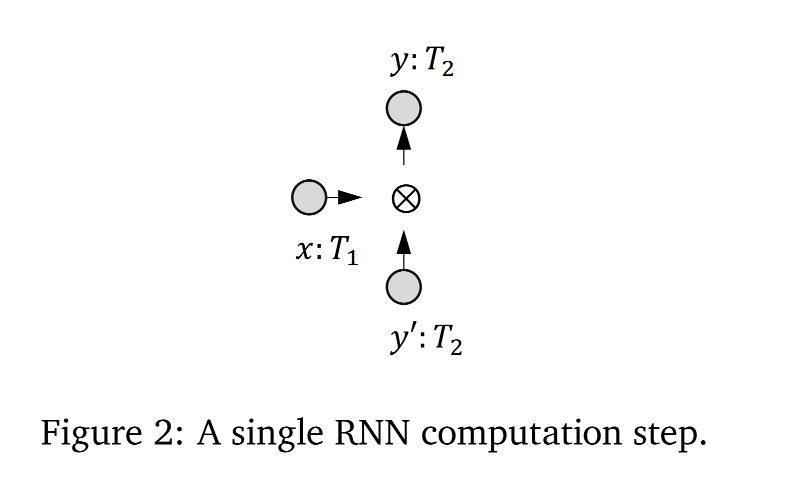
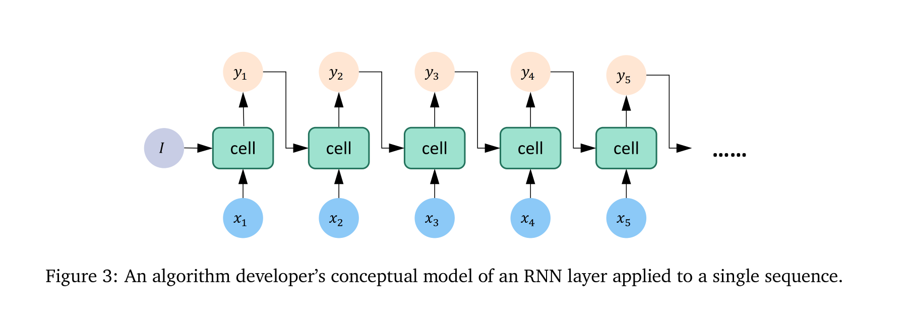
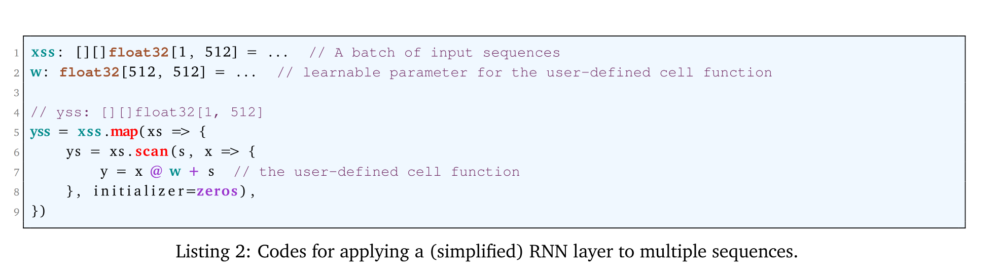
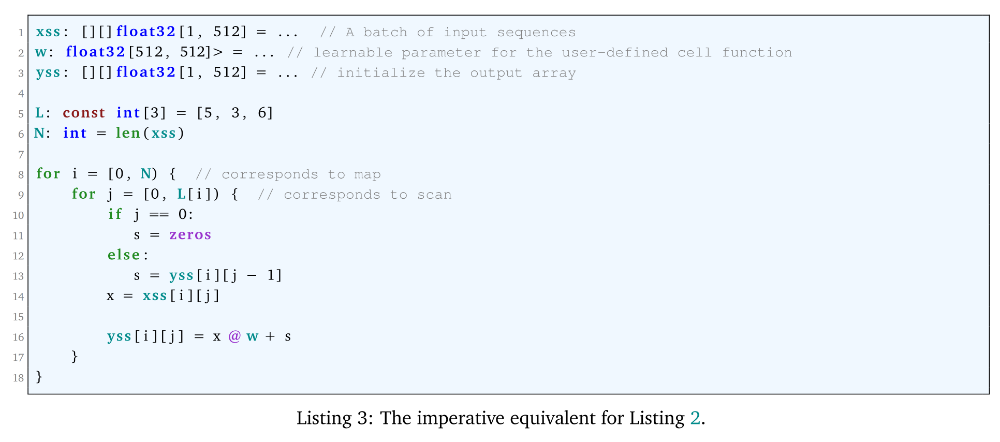
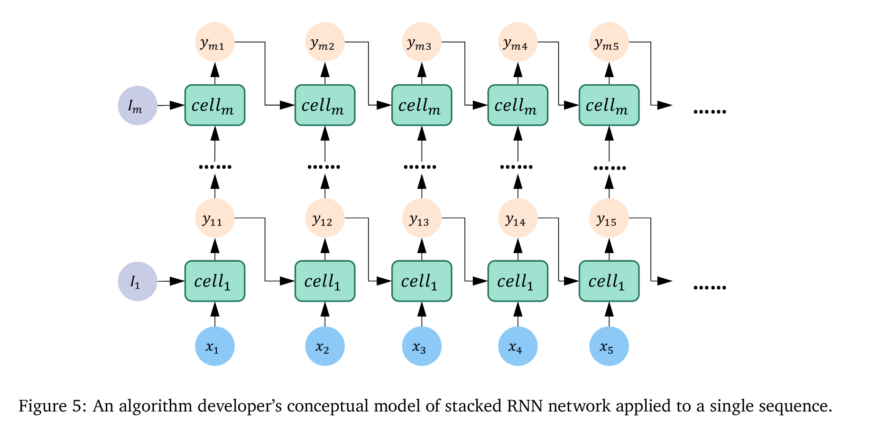
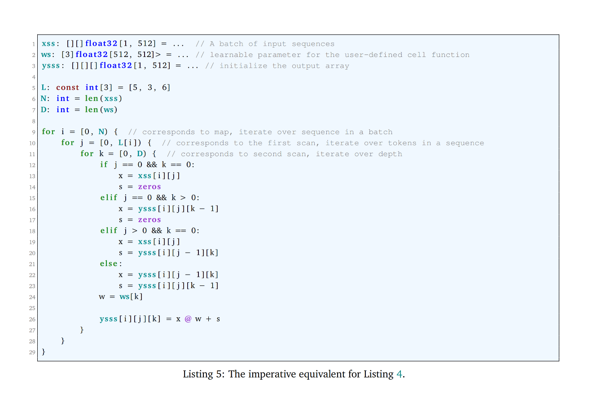
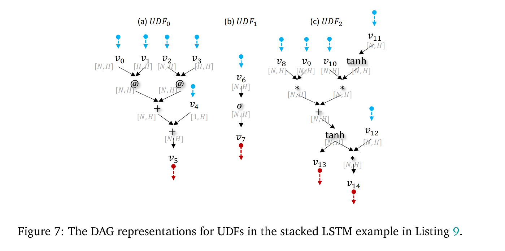
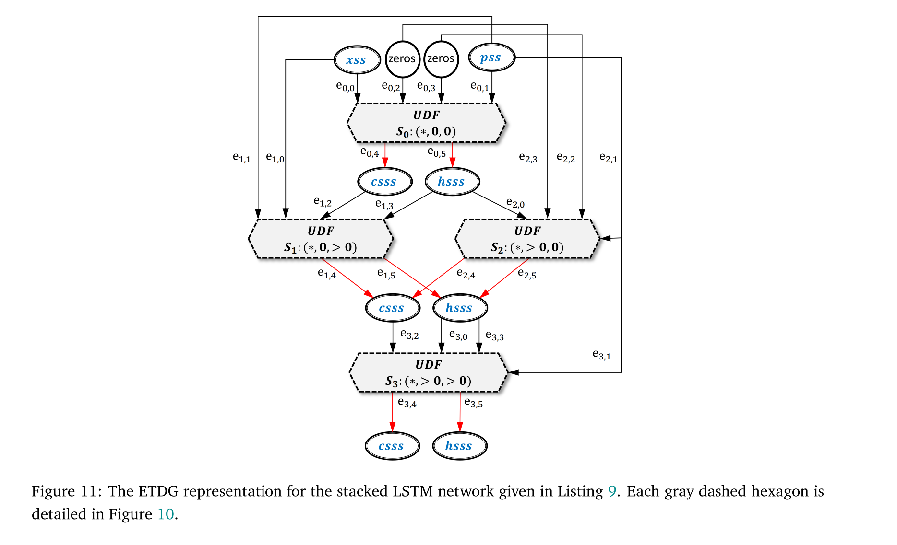
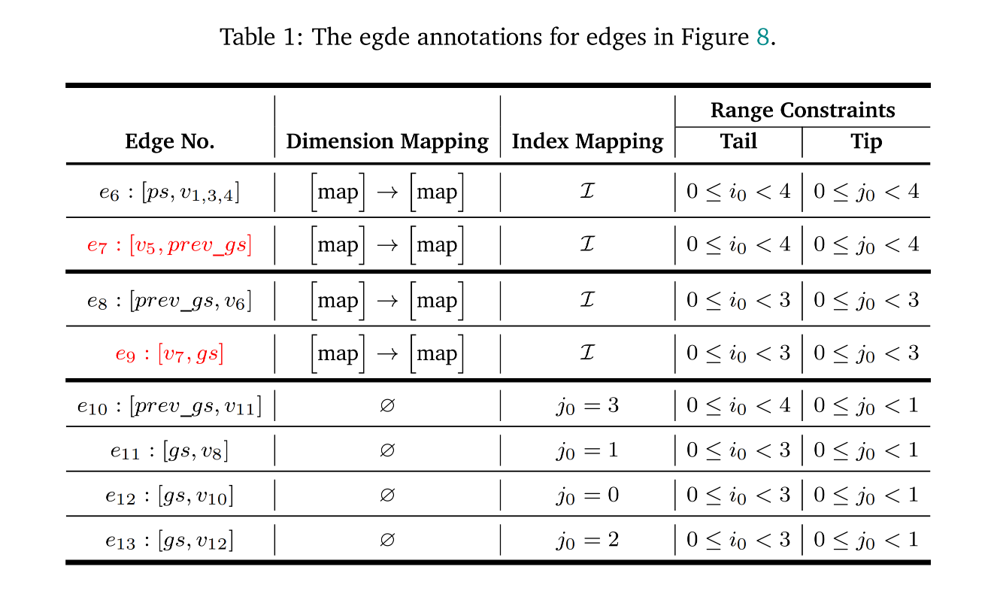

# FractalTensor 笔记

## 数据结构

TensorShape, Number, Tensor 和 FractalTensor 是定义在编译器和运行时系统中的 first-class types。

Tensor 是一个形状规则的高维度数组。嵌套的 FractalTensor 把一个 Tensor 分成两个部分：

- 内部最完整形状的维度，被编码为 `TensorShape`。

- **data-dependent dimensions** 总是包围 fully-shaped 维度。真正的威力在于这些依赖于数据的维度由并行模式和访问模式明确控制和编程，这为我们提供了一种清晰的方法来推理可能的调度选项，对嵌套在FractalTensor中的完整形状张量进行排列、打包或分区。

两层的 indexing-tree 的 FractalTensor xss 展示如图 Figure1 (a)：

- xss 有 23 个同类型的 tensor，每一个的 shape 都是 [1, 512]。

- 0-7 是第二层第一个元素，8-12 是第二层第二个元素，13-22 是第二层第三个元素。

## 使用 FractalTensors 组织神经网络计算

FractalTensor 只支持两种类型操作: parallel patterns 和 access patterns。并行模式可以同时迭代某个深度上的元素，访问模式用于在某一特定深度上对于 FractalTensor 上的元素进行重排序。

### General recurrence

#### A simplified RNN layer

在 Figure 2 中，x 和 y' 通过 cell 处理单元形成一个新的 y。

Figure 3 中展示了算法开发者眼中 RNN layer 从一个序列中。一个 RNN layer 总是伴随着 a batch of sequences 来训练。Figure 4 中展示了对于多个序列同时应用了 RNN layer。

#### A simplified stacked RNN network

将多个 RNN layers 从深度神经网络堆叠起来。每个 RNN layers 有自己的学习参数。Figure 5 展示了开发者对于 stacked RNN network 的视角。

Stacked RNN network 总是被一批次的 sequences 所训练。Figure 6 展示了同时在多个 sequences 上使用 RNN layer，Listing 4 是使用 FractalTensor 的构建方法。

## Program Analysis for the Motivating Example: Stacked LSTM

### User program and program representation

Listing 9 是 stacked LSTM network 的用户代码。

通过将控制流边界进行分割，Listing 10 简化了 Listing 9 的控制结构，Figure 7 给出了每一个 UDF 的 DAG 表示。Figure 8 给出了从原始的 user code 得到的图形表示。

### Program analysis and IR transformations

#### Convert conditional branches to dataflow edges

为了将状态分支变得更为直觉，Listing 9 给出了 FractalTensor program 的同等描述。

由于 fold，scan 和其他步骤的数据访问不同，由 map，fold，scan 组成的完美并行模式实际上有四个状态分支。后续代码生成的复杂度在于这四个控制区域有不同的访问行为并且携带不同的数据依赖。

#### Restructure data to expose maximal data-parallelism

附加到 FractalTensors 上的并行模式明确地高速 data-parallel 语义。Aggregate 模式包含 reduce, fold, scan 携带数据依赖，被叫做 loop-carried dependence。当 parallel patterns 被嵌套的很深的时候，最大并行度可能仍然是不明确的，所有的循环神经网络都属于 loop-carried dependence 的例子。

Dependence distance vector 能够表示 reduce, fold 和 scan 的迭代之间的前序约束关系。并且它们都是数值为正的单元向量。具有非负正距离的距离向量有一个独特的属性：它是全部可置换的，这是在应用各种转换前的必要规范形式。值得注意的是，一个具有正距离向量的深度为 d 的完全可置换的嵌套循环最多只有一个顺序循环，即最佳的细粒度并行性。这个独特的属性保证了嵌套的并行模式是完全可置换的，而对于一个并行模式的嵌套，最多只有一个顺序循环。
