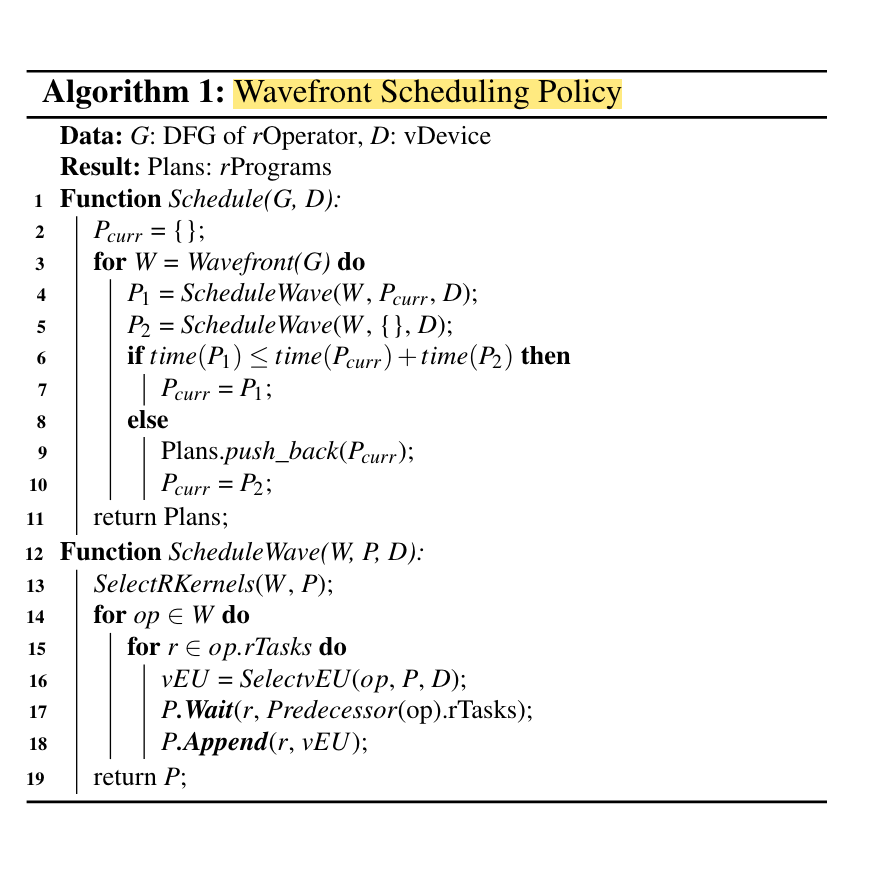

# nnfusion 源码阅读

首先进入 `tools/nnfusion/nnfusion.cpp` 进入 main 函数开始执行，以 tensorflow、CUDA_GPU 为例进行解析：

- `nnfusion::frontend::load_tensor_model()` 用来加载 tensorflow 模型并将其转化成图。

- 若编译器后端非空，则执行 `cuda_engine.run_on_graph(graph)`，其中 `cuda_engine` 为建立的的空的 `CudaEngine` Object。

## 前端

以 tensorflow 为例，首先查看 `frontend/tensorflow_import/tensorflow.cpp`:

## 后端

观察 `CudaEngine` 发现其是 `Engine` 的子类，`Engine` 有以下几个私有变量：

- `InterpreterPassManager::Pointer m_passes`

- `GraphPassManager::Pointer g_passes`

- `GraphVisitor::Pointer g_visitor`

观察 `Engine::run_on_graph(graph::Graph::Pointer graph, EngineContext::Pointer context)` 的实现，发现分别执行以下三个函数：

- `g_passes->run_on_graph(graph, context)`

- `g_visitor->run_on_graph(graph, context)`

- `g_visitor->run_on_graph(graph, context)`


基于上图不难推断：

- `g_passes->run_on_graph(graph, context)` 用于将算子数据流图转成 rOperator 的数据流图

- `g_visitor->run_on_graph(graph, context)` 用于将 rOperator 的数据流图转成 rProgram

- `g_visitor->run_on_graph(graph, context)` 用于将 rProgram 转换成设备可运行的代码

### rOperation 生成

观察 `GraphPassManager::Pointer` 是一个继承自`vector<shared_ptr<nnfusion::pass::graph::GraphPassBase>>` 的类，有一个 `run_on_graph` 的方法。

观察 `GraphPassBase` 发现其是一个基类，里面没有任何私有数据。考虑到 `CudaEngine` 在初始化时向 `g_passes` push 了很多派生类：

```cpp
CudaEngine::CudaEngine()
    : Engine()
{
    g_passes->push_back(make_shared<CSEPass>());
    g_passes->push_back(make_shared<AutodiffPass>());
    g_passes->push_back(make_shared<GradientWeightMappingPass>());
    g_passes->push_back(make_shared<RuntimeConstantFoldingPass>());
    g_passes->push_back(make_shared<MultiReshapeFoldingPass>());
    g_passes->push_back(make_shared<VectorDotTransposePass>());
    g_passes->push_back(make_shared<GemmFusionPass>());
    g_passes->push_back(make_shared<BatchNormInferenceFoldingPass>());
    g_passes->push_back(make_shared<AssignLayoutPass>());
    g_passes->push_back(make_shared<OpInplacePass>());

    g_passes->push_back(make_shared<PatternSubstitutionPass>());

    // Kernel selection
    g_passes->push_back(make_shared<DefaultGNodeDeviceDispatcher>());
    g_passes->push_back(make_shared<ProfilingBasedKernelSelector>());
    g_passes->push_back(make_shared<FetchBasedSelector>());
    g_passes->push_back(make_shared<DefaultKernelSelector>());

    // GPU specific graph passes
    g_passes->push_back(make_shared<KernelFusionPass>());
    g_passes->push_back(make_shared<KernelProfilingPass>());
    g_passes->push_back(make_shared<PatternSubstitutionPass>());
    g_passes->push_back(make_shared<BlockFusionPass>());

    // Specific opt for dot
    g_passes->push_back(make_shared<DotTransposePass>());

    // Assign stream passes
    g_passes->push_back(make_shared<AssignAsyncInfoPass>());

    // Visitor
    g_visitor = make_shared<ReversedDFSVisitor>();

    // extract graph signature
    m_passes->push_back(make_shared<ExtractGraphSignature>());
    // Do tensor allocation plan
    m_passes->push_back(make_shared<TensorDeviceDispatcher>());
    m_passes->push_back(make_shared<TensorLivenessAnalysis>());
    m_passes->push_back(make_shared<InplaceTensorAnalysis>());
    m_passes->push_back(make_shared<AssignTensorMemoryLayout>(64, false));

    // Do codegen
    m_passes->push_back(make_shared<CudaCodegenPass>());
}
```

点入 `CSEPass` 查看，发现其中实现了 `run_on_graph()`:

```cpp
bool CSEPass::run_on_graph(std::shared_ptr<Graph>& graph)
{
    bool enable_cse = FLAGS_fcse;
    if (!enable_cse)
        return true;

    bool replaced = false;
    unordered_map<NodeKey, shared_ptr<GNode>> expressions{};

    for (auto n : graph->get_ordered_ops())
    {
        auto op = n->get_op_ptr();
        if (op->is_output() || op->is_parameter())
        {
            continue;
        }

        NodeKey n_key(n);
        if (expressions.count(n_key))
        {
            graph->replace_node(n, expressions.at(n_key), false);
            replaced = true;
        }
        else
        {
            expressions.insert(make_pair(n_key, n));
        }
    }
    return true;
}
```

### rProgram 生成

在 `cuda.cpp` 中初始化 `CudaEngine` 的时候将 `g_vistor` 初始化了为 `ReversedDFSVistor`，在 `ReversedDFSVistor` 中实现了 `run_on_graph` 的方法：

```cpp
nnfusion::ir::Program::Pointer ReversedDFSVisitor::run_on_graph(shared_ptr<graph::Graph> graph,
                                                                EngineContext::Pointer context)
{
    NNFUSION_LOG(INFO) << "Translating graph:\t" << graph->get_name();

    auto program =
        make_shared<ir::Program>(nnfusion::ir::Program::create_single_basic_block_program());
    auto bb_main = program->get_entry();

    // Translate the Node
    // Currently:
    // * Translate each gnode into an instruction;
    // * Store all instruction inside one basicblock since we don't have
    //   control-flow by now.
    nnfusion::graph::GNodeVector node_vec;
    if (FLAGS_fstream_assign_policy == "kernel_prof_based")
        node_vec = graph->get_bfs_ordered_ops();
    else
        node_vec = graph->get_ordered_ops();

    for (auto gnode : node_vec)
    {
        shared_ptr<TranslationUnit> _tu(new TranslationUnit());
        nnfusion::ir::Instruction::Pointer ir(new nnfusion::ir::Instruction);
        ir->setGNode(gnode);
        ir->copy_tags_from(*gnode);
        ir->setName(gnode->get_name());
        bb_main->push_back(ir);
        add_memcpy_ir(graph, gnode, bb_main);
    }

    return program;
}
```

首先创建一个空的 program，并将图中的算子转换成算子节点的集合（在论文中称为 rTask)，随后遍历节点集合。

这里的 Program 是一个 `BasicBlock` 的向量集合，而 `BasicBlock` 又是 `Instruction` 的向量集合，而 `Instruction` 是一个简单包裹的类型，有 `gnode`、`kernel`、`inputs`，`outputs`，`internal_tensors` 等属性，其中 `kernel` 是一个 `KernelEmitter` 类型，可以对一个操作符生成特殊的计算 kernel，也就是论文中提到的 rKernels。因此 `Instruction` 可以看成是一个 `rTask` 也就是可以执行的最小单元。



在遍历节点集合过程中的重点是 `add_memcpy_ir(graph, gnode, bb_main)` 的调用：

- 首先根据不同的类型创建不同的 `AsyncManagerFactor`

- 随后遍历该节点的所有出边，若出边不是自己的话，也即是从该节点到下一个节点有数据流通过，创建一个 `memcpy_ir`，也即在中间插入一个内存拷贝的指令。随后将 memcpy_ir 的输入 tensor 修改为出边节点的输入 tensor， 将输出 tensor 设置为新建的 tensor。

- 随后检查 `memcpy_ir` 和输出节点的 `execution_thread` 是否为一个，若不相同的话则添加等待队列和屏障。

### 代码生成

生成 program 后，调用 `m_passes->run_on_program(p, context)` 用来进行代码生成，检查 `run_on_program()` 函数：

- 首先初始化 `_tu`(翻译单元，暂时不知道做什么的)和 `ctx`

- 遍历所有 pass 进行运行

检查 `nnfusion/engine/device/cuda.cpp`，发现 `CudaEngine` 在初始化时添加了如下的 pass:

```cpp
    // extract graph signature
    m_passes->push_back(make_shared<ExtractGraphSignature>());
    // Do tensor allocation plan
    m_passes->push_back(make_shared<TensorDeviceDispatcher>());
    m_passes->push_back(make_shared<TensorLivenessAnalysis>());
    m_passes->push_back(make_shared<InplaceTensorAnalysis>());
    m_passes->push_back(make_shared<AssignTensorMemoryLayout>(64, false));

    // Do codegen
    m_passes->push_back(make_shared<CudaCodegenPass>());
```

因此，代码生成部分会依次遍历以上所有 pass 并执行 `run()` 方法。
