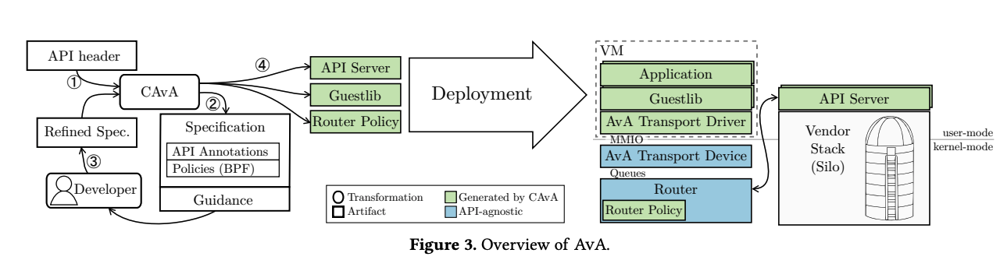

# 虚拟化硬件加速器调研

## 单机中的虚拟化

理论上 AI 硬件加速器虚拟化和传统设备的虚拟化没什么区别，都是通过 SR-IOV 技术可以将 PCIe 总线连接的设备虚拟化成虚拟的 PCIe 设备从而给主机使用以达到资源隔离。目前可以通过虚拟化总线级的加速器设备以达到资源隔离。因此可以使用传统的虚拟化技术技术或者容器技术来达到资源隔离，例如在 github 上有通过 LXD 技术来将 GPU 虚拟化来给不同用户使用的：[GitHub - shenuiuin/LXD_GPU_SERVER: 实验室GPU服务器的LXD虚拟化](https://github.com/shenuiuin/LXD_GPU_SERVER)。

与传统设备虚拟化不同的是，AI 加速器的虚拟化需要搭配上具体的软件栈与驱动，例如 Nvidia 与 CUDA，RoCm GPU 与 OpenCL。一次通过 SR-IOV 虚拟化后对于不同的设备依然要通过不同的软硬件栈去实现，然而这样配置环境十分麻烦。

这里介绍一下 ASPLOS‘20 的文章：[AvA: Accelerated Virtualization of Accelerators](https://dl.acm.org/doi/pdf/10.1145/3373376.3378466)，这篇文章提出了一种加速器虚拟化解决方案，通过自己设计了一个 DSL 编译器并提供了 API 接口，通过计算卸载了加速器 API，例如 OpenCL，CUDA 以及 Tensorflow 等用于在不同的硬件加速器上进行执行。

上图展示了通过设计的 DSL 写 GPU 加速器代码以及使用 guestlib 生成的代码。

论文中设计的 DSL 叫做 Lapis，Lapis是一种用于编写API规范的高级规范语言。它被设计用于描述计算卸载加速器API的行为和语义。以下是Lapis的一些特点：

- 高级性：Lapis提供了高级抽象和表达能力，使得开发人员可以描述API的操作、参数、返回值以及它们之间的关系，而无需关注具体的实现细节。这使得规范更易于理解和编写，并且可以促进规范的复用和扩展。

- API特定性：Lapis专门为特定的API设计，例如OpenCL、CUDA和TensorFlow等计算卸载加速器API。它提供了与这些API相关的语法、语义和约束，以便更准确地描述API的行为。

- 自动生成代码：Lapis的规范可以被CAvA编译器自动转换为API特定组件的代码实现。这样，开发人员可以通过编写规范来定义API的行为，而无需手动编写大量的模板代码。这种自动生成代码的方式可以提高开发效率并减少错误。

以上所有的虚拟化方式的粒度要不然是总线级（PCIe）或者 VF 级，一般是整个设备被虚拟化被用户使用，目前没有更加细粒度虚拟化的解决方案。

## 集群中的虚拟化

在集群上的虚拟化与一个主机差不多，只不过需要通过一个集群管理技术来管理多个集群的资源。kubernets 提供了服务器集群管理技术，而 kubevirt 则更进一步将虚拟化技术与集群管理技术结合起来可以对服务器集群进行管理，不过异构加速器之间的通信可能会带来一些问题。

不过目前大部分的服务器集群的主流依然是同构加速器，这样更好进行通信以及环境的配置与虚拟机迁移。在这方面也有一些虚拟化相关的研究，但主要是为了在大规模集群中更好利用硬件性能的文章,，例如：

- IPADS 的：[Accelerator Virtualization Framework Based on Inter-VM Exitless Communication](https://www.jos.org.cn/josen/article/abstract/6068)

- arxiv 上的一篇：[AVEC: Accelerator Virtualization in Cloud-Edge
  Computing for Deep Learning Libraries](https://arxiv.org/pdf/2103.04930.pdf)

除此之外，一些公司的商业化产品似乎也提到了使用异构加速器来进行 AI 任务：https://anil-35205.medium.com/ai-virtualization-e384a2454301
